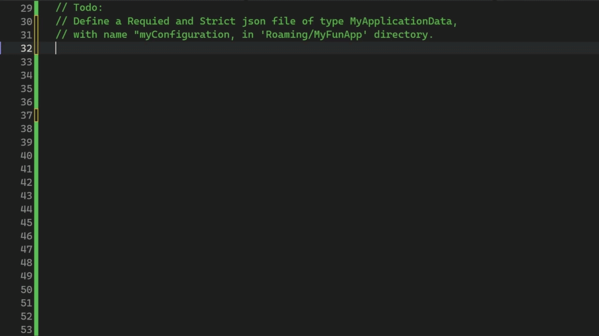

<h1 align="center">
  FileCompositions
</h1>

<div align="center">
  <a href="https://github.com/SzymonFrac/FileCompositions/releases/latest"></a>
  <a href="https://www.nuget.org/packages/FileCompositions.Core/"></a>
  <a href="LICENSE.txt"></a>

  <br>

  <a href="https://github.com/SzymonFrac/FileCompositions/tree/master/docs">Documentation</a> |
  <a href="https://github.com/SzymonFrac/FileCompositions/tree/master/CONTRIBUTING.md">Contributions</a>
</div>

<p align="center">
  FileCompositions is a C# library that allows a program to define files and directories as resources in DI from many file systems.
</p>



## 🔍 Who is this library for?

This library is primarily designed for desktop applications that manage files, directories, databases, and other storage resources on the client machine.
\
Its goal is to centralize storage management through dependency injection, reducing boilerplate code and making storage requirements easier to evolve as an application grows.

Future versions *may* expand beyond local desktop storage, including support for mobile platforms and cloud-backed storage providers, but is primarily for clients.

## ✨ Features

1. 📁 Treat files and directories as injectable services.
2. 🔧 Automatically create and initialize required storage on startup.
3. 📄 Support common [file types](docs/File/Types) such as JSON, databases, and assemblies.
4. 🏗️ Seamless integration with .NET dependency injection and IHost.

## 🚀 Roadmap

1. 🌐 Cloud file systems (Azure Blob Storage, S3, GCS, etc.).
2. 🧩 Custom file type composition and extensible architecture for custom and private file systems.
3. 🔗 Support for dependency graphs between file definitions.
4. ✅ File-type-specific validation and integrity checks.
5. 🏗️ Integration beyond IHost and the default Microsoft DI container.
6. 📚 Unified abstractions for common file formats.
7. 📝 Log your files and directories to clean any obsolete definitions.

## Requirements
Targets
`.NET 10.0`

## Installation
Via [NuGet](https://www.nuget.org/packages/FileCompositions.Core)
```sh
dotnet add package FileCompositions.Core
```

Currently [FileCompositions.Hosting](https://www.nuget.org/packages/FileCompositions.Hosting) is the only way of defining file resources using `IHost`
```sh
dotnet add package FileCompositions.Hosting
```

## Getting Started
To get started, use the IHost extension to configure file resources.
```csharp
private static IHost CreateHost() => Host.CreateDefaultBuilder()
  .ConfigureFileComposition(schema =>
  {
    ...
  })
  ...
  .Build()
```

### Add Definitions
To add any files, you first must define a directory.

> [!IMPORTANT]
> Be aware that any definition can be created in your file system.
> When testing, make sure that your file system is cleared afterward if you are not using a definition anymore.

```csharp
// Todo:
// Define a Requied and Strict json file of type MyApplicationData, with name "myConfiguration"
// in 'Roaming/MyFunApp' directory.

static IHost CreateHost() => Host.CreateDefaultBuilder()
    .ConfigureFileComposition(schema =>
    {
        schema.ConfigureDefinitions(registrar => registrar
            .Store(directory =>
            {
                directory.Define(def => def
                    .CreateLocal(Environment.SpecialFolder.ApplicationData,
                        "MyFunApp")
                    .WithKey(new DirectoryDefinitionKey(0)));

                directory.WithFiles(files => files
                    .DefineJson(json => json
                        .Create<MyApplicationData>()
                        .WithName("myConfiguration")
                        .WithKey(new FileDefinitionKey(0))));

                return directory;
            }));
    })
    .Build();
```

> [!Note]
> Initially, every definition is `Required` and `Strict` unless configured otherwise.
> Find out more about [`Qualities`](/docs/Qualities)

### Use your Definitions
Finally, use your definitions like any other DI service.

```csharp
public class MyConsumerClass
{
    private readonly IJsonDefinition<StrictDefinition, RequiredInRequired, MyApplicationData> _jsonFile;

    public MyConsumerClass([FromKeyedServices(0)] IJsonDefinition<StrictDefinition, RequiredInRequired, MyApplicationData> jsonFile) =>
        _jsonFile = jsonFile;

    public Task<MyApplicationData> ReadSampleFile(CancellationToken cancellationToken = default) =>
        _jsonFile.ReadAsync(cancellationToken);
}
```
